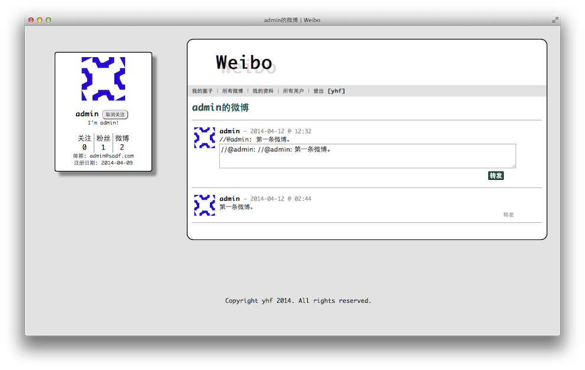

yhfWeibo
========

基于Flask的微博系统，实现了基本的微博功能。

数据库采用SQLite3，用户头像采用[http://www.gravatar.com](http://en.gravatar.com/site/implement/hash/)提供的用邮箱的哈希值生成的url。

功能:

* 用户注册、登录
* 发表、转发微博
* 查看用户资料
* 查看用户关注、粉丝名单
* 查看我的圈子的动态

DEMO:

